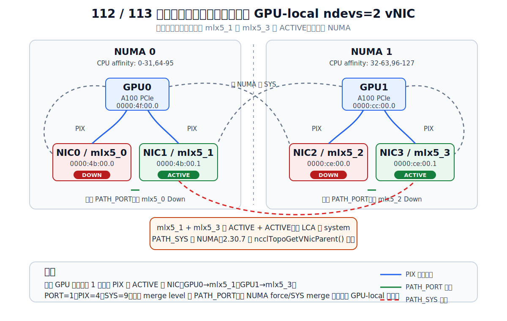

# NCCL IB resiliency failover/failback 与错误注入分析

本地 NCCL 源码版本：`2.30.7`

```make
NCCL_MAJOR   := 2
NCCL_MINOR   := 30
NCCL_PATCH   := 7
NCCL_SUFFIX  :=
PKG_REVISION := 1
```

本文回答两个问题：

1. 为什么此前在 112/113 上跑 NCCL 容错 failback 不成功。
2. 能不能通过修改现有错误注入库，把 `mlx5_1 + mlx5_3` 在不恢复 `mlx5_0` / `mlx5_2` 的情况下跑成有效的 `ndevs=2` failover/failback 实验。

结论先放前面：

- 当前 112/113 上真正 `ACTIVE/LINK_UP` 的 IB/RoCE 端口只有 `mlx5_1` 和 `mlx5_3`。
- `mlx5_1` 在 NUMA0，GPU0 到它是 `PIX`；`mlx5_3` 在 NUMA1，GPU1 到它是 `PIX`。但 `mlx5_1 <-> mlx5_3` 跨 NUMA，NCCL 视作 `PATH_SYS`。
- 默认 NCCL 自动 NIC fusion 的 merge level 是 `PATH_PORT`，不会自动跨 `PATH_SYS` 合并。
- 把 `NCCL_NET_MERGE_LEVEL=SYS` 或 `NCCL_NET_FORCE_MERGE=mlx5_1,mlx5_3` 后，远端 NCCL 二进制会先造出 `mlx5_1+mlx5_3` vNIC，然后在拓扑挂载阶段拒绝跨 NUMA vNIC：`Fusing NET devices from different NUMA domains is not supported.`
- 不融合时，NCCL 能正常跑通，但实际 resiliency communicator 只有 `1 local device`，NCCL 自己也打印了 `single device` 警告，所以没有 failover 目标，更谈不上 failback。
- 现有错误注入库只 hook `ibv_context->ops.poll_cq` 并篡改 CQE 状态，发生在 NCCL 初始化、拓扑解析、vNIC 创建、QP 创建之后。它不能让 DOWN 端口变成 ACTIVE，也不能改变 `vProps.ndevs`，所以单独改当前 CQE 注入粒度无法把当前物理状态跑成有效的 `ndevs=2` failback 实验。
- 要做有效实验，最可信路径是恢复同卡端口 `mlx5_0` 或 `mlx5_2`；若必须不恢复硬件，只能做“实验性 NCCL 代码路径验证”：给 NCCL 加 env-gated 跨 NUMA force merge 旁路，再用更精细的 CQE 注入触发 failover/failback。这个实验能测 NCCL 状态机，但不是一个 GPU-local/PIX 的真实容错拓扑。

## 1. 状态查看命令

这些状态使用以下命令查看：

```bash
nvidia-smi topo -m
ibdev2netdev
rdma link show

for d in mlx5_0 mlx5_1 mlx5_2 mlx5_3; do
  pci=$(basename "$(readlink -f /sys/class/infiniband/$d/device)")
  numa=$(cat /sys/class/infiniband/$d/device/numa_node)
  state=$(cat /sys/class/infiniband/$d/ports/1/state)
  phys=$(cat /sys/class/infiniband/$d/ports/1/phys_state)
  echo "$d pci=$pci numa=$numa state=$state phys_state=$phys"
done

lspci -nn | egrep "(4b:00|ce:00|4f:00|cc:00)"
```

这里的 `Up` 是 `ibdev2netdev` 对应 netdev 的链路状态；对 NCCL/verbs 更关键的是 RDMA port state。NCCL 在 IB 设备枚举时会调用 `ibv_query_port`，并且只接受 `IBV_PORT_ACTIVE`，代码位置是 `src/transport/net_ib/init.cc:357-365`：

```cpp
if (portAttr.state != IBV_PORT_ACTIVE) continue;
```

## 2. 112/113 真实拓扑结果


### 2.1 112：`192.168.5.112` / `xfusion-2`

```text
HOST=xfusion-2
== nvidia-smi topo -m ==
        GPU0    GPU1    NIC0    NIC1    NIC2    NIC3    CPU Affinity    NUMA Affinity    GPU NUMA ID
GPU0     X      SYS     PIX     PIX     SYS     SYS     0-31,64-95     0                N/A
GPU1    SYS      X      SYS     SYS     PIX     PIX     32-63,96-127   1                N/A
NIC0    PIX     SYS      X      PIX     SYS     SYS
NIC1    PIX     SYS     PIX      X      SYS     SYS
NIC2    SYS     PIX     SYS     SYS      X      PIX
NIC3    SYS     PIX     SYS     SYS     PIX      X

NIC Legend:
  NIC0: mlx5_0
  NIC1: mlx5_1
  NIC2: mlx5_2
  NIC3: mlx5_3

== ibdev2netdev ==
mlx5_0 port 1 ==> ens7f0np0 (Down)
mlx5_1 port 1 ==> ens7f1np1 (Up)
mlx5_2 port 1 ==> ens10f0np0 (Down)
mlx5_3 port 1 ==> ens10f1np1 (Up)

== rdma link show ==
link mlx5_0/1 state DOWN physical_state DISABLED netdev ens7f0np0
link mlx5_1/1 state ACTIVE physical_state LINK_UP netdev ens7f1np1
link mlx5_2/1 state DOWN physical_state DISABLED netdev ens10f0np0
link mlx5_3/1 state ACTIVE physical_state LINK_UP netdev ens10f1np1

== sysfs mlx5 ==
mlx5_0 pci=0000:4b:00.0 numa=0 state=1: DOWN phys_state=3: Disabled
mlx5_1 pci=0000:4b:00.1 numa=0 state=4: ACTIVE phys_state=5: LinkUp
mlx5_2 pci=0000:ce:00.0 numa=1 state=1: DOWN phys_state=3: Disabled
mlx5_3 pci=0000:ce:00.1 numa=1 state=4: ACTIVE phys_state=5: LinkUp

== lspci selected ==
4b:00.0 Ethernet controller: Mellanox Technologies MT43244 BlueField-3 integrated ConnectX-7 network controller
4b:00.1 Ethernet controller: Mellanox Technologies MT43244 BlueField-3 integrated ConnectX-7 network controller
4b:00.2 DMA controller: Mellanox Technologies MT43244 BlueField-3 SoC Management Interface
4f:00.0 3D controller: NVIDIA Corporation GA100 [A100 PCIe 40GB]
cc:00.0 3D controller: NVIDIA Corporation GA100 [A100 PCIe 40GB]
ce:00.0 Ethernet controller: Mellanox Technologies MT43244 BlueField-3 integrated ConnectX-7 network controller
ce:00.1 Ethernet controller: Mellanox Technologies MT43244 BlueField-3 integrated ConnectX-7 network controller
ce:00.2 DMA controller: Mellanox Technologies MT43244 BlueField-3 SoC Management Interface
```

### 2.2 113：`192.168.5.113` / `xfusion-3`

```text
HOST=xfusion-3
== nvidia-smi topo -m ==
        GPU0    GPU1    NIC0    NIC1    NIC2    NIC3    CPU Affinity    NUMA Affinity    GPU NUMA ID
GPU0     X      SYS     PIX     PIX     SYS     SYS     0-31,64-95     0                N/A
GPU1    SYS      X      SYS     SYS     PIX     PIX     32-63,96-127   1                N/A
NIC0    PIX     SYS      X      PIX     SYS     SYS
NIC1    PIX     SYS     PIX      X      SYS     SYS
NIC2    SYS     PIX     SYS     SYS      X      PIX
NIC3    SYS     PIX     SYS     SYS     PIX      X

NIC Legend:
  NIC0: mlx5_0
  NIC1: mlx5_1
  NIC2: mlx5_2
  NIC3: mlx5_3

== ibdev2netdev ==
mlx5_0 port 1 ==> ens7f0np0 (Down)
mlx5_1 port 1 ==> ens7f1np1 (Up)
mlx5_2 port 1 ==> ens10f0np0 (Down)
mlx5_3 port 1 ==> ens10f1np1 (Up)

== rdma link show ==
link mlx5_0/1 state DOWN physical_state DISABLED netdev ens7f0np0
link mlx5_1/1 state ACTIVE physical_state LINK_UP netdev ens7f1np1
link mlx5_2/1 state DOWN physical_state DISABLED netdev ens10f0np0
link mlx5_3/1 state ACTIVE physical_state LINK_UP netdev ens10f1np1

== sysfs mlx5 ==
mlx5_0 pci=0000:4b:00.0 numa=0 state=1: DOWN phys_state=3: Disabled
mlx5_1 pci=0000:4b:00.1 numa=0 state=4: ACTIVE phys_state=5: LinkUp
mlx5_2 pci=0000:ce:00.0 numa=1 state=1: DOWN phys_state=3: Disabled
mlx5_3 pci=0000:ce:00.1 numa=1 state=4: ACTIVE phys_state=5: LinkUp
```


### 2.3 从拓扑得到的结论

当前可用的 ACTIVE 端口只有：

| 端口 | PCI | NUMA | 状态 | GPU-local 关系 |
|---|---:|---:|---|---|
| `mlx5_1` | `0000:4b:00.1` | 0 | `ACTIVE/LINK_UP` | GPU0 到它是 `PIX` |
| `mlx5_3` | `0000:ce:00.1` | 1 | `ACTIVE/LINK_UP` | GPU1 到它是 `PIX` |

不可用端口：

| 端口 | PCI | NUMA | 状态 |
|---|---:|---:|---|
| `mlx5_0` | `0000:4b:00.0` | 0 | `DOWN/DISABLED` |
| `mlx5_2` | `0000:ce:00.0` | 1 | `DOWN/DISABLED` |

因此：

- 如果 `mlx5_0` 可用，`mlx5_0 + mlx5_1` 是同卡/同 PCI 侧的 `PATH_PORT`，GPU0 能拿到本地 `ndevs=2`。
- 如果 `mlx5_2` 可用，`mlx5_2 + mlx5_3` 是同卡/同 PCI 侧的 `PATH_PORT`，GPU1 能拿到本地 `ndevs=2`。
- 现在只能剩下 `mlx5_1 + mlx5_3`。它们跨 NUMA，公共父节点到 `system`，是 `PATH_SYS`，不是 GPU-local 的 `PIX`/同卡 `PATH_PORT`。

### 2.4 当前拓扑示意图



这张图对应上面的真实探测结果：同卡 `PATH_PORT` 组合因为 `mlx5_0` / `mlx5_2` down 而不可用，剩下的 active 组合 `mlx5_1 + mlx5_3` 跨 NUMA，是 `PATH_SYS`。

## 3. NCCL 代码相关和 fusion

### 3.1 NCCL path 的级别定义

代码位置：`src/include/graph.h:125-151`

```cpp
#define PATH_PIX 4
#define PATH_SYS 9
#define PATH_PORT PATH_NVL
```

`PATH_SYS` 比 `PATH_PIX` 更远。`PATH_PORT` 是用于多端口同卡场景的特殊近距离路径。

### 3.2 NCCL 如何判定 `PATH_PORT` 与 `PATH_SYS`

代码位置：`src/graph/topo.cc:1118-1220`

关键逻辑：

- `ncclTopoGetPath()` 先找多个 net node 的公共父节点。
- 如果父 PCI bus id 只有最后一位不同，会判为 multi-port，并设置 `PATH_PORT`，代码在 `src/graph/topo.cc:1160-1194`。
- 如果公共父节点是 `system`，设置 `PATH_SYS`，代码在 `src/graph/topo.cc:1199-1202`。

这解释了为什么：

- `mlx5_0(4b:00.0) + mlx5_1(4b:00.1)` 是同卡多端口，能走 `PATH_PORT`。
- `mlx5_2(ce:00.0) + mlx5_3(ce:00.1)` 是同卡多端口，能走 `PATH_PORT`。
- `mlx5_1(4b:00.1) + mlx5_3(ce:00.1)` 跨 NUMA，公共父节点是 system，走 `PATH_SYS`。

### 3.3 默认自动 merge 不跨 `PATH_SYS`

代码位置：`src/graph/topo.cc:1738-1745`

```cpp
if (mergeLevelEnv) {
  kvConvertToInt(mergeLevelEnv, mergeLevel, nicPathKvList);
} else {
  *mergeLevel = PATH_PORT;
}
```

自动 merge 的选择条件在 `src/graph/topo.cc:1392-1421`。2.30.7 这里除了 `paths <= mergeLevel`，还会检查 `mergePolicy`；默认 `NCCL_NET_MERGE_POLICY=ALL` 时 rail 条件短路为 true：

```cpp
if ((paths[i * nPhysDevs + j] <= netInfo->mergeLevel) &&
    (placedDevs[j] == 0 && j != i) &&
    (netInfo->mergePolicy != NCCL_NET_MERGE_POLICY_RAIL ||
     (propsList[i].railId != NCCL_NET_ID_UNDEF &&
      propsList[i].railId == propsList[j].railId))) {
  vProps.devs[vProps.ndevs++] = j;
  placedDevs[j] = 1;
}
```

默认 `mergeLevel=PATH_PORT`，所以 `PATH_SYS` 不会自动融合。

### 3.4 force merge 与 vNIC 创建

强制融合入口：`src/graph/topo.cc:1311-1363`

```cpp
INFO(NCCL_ENV | NCCL_NET,
     "TOPO/NET : Force-fusing NICs using NCCL_NET_FORCE_MERGE=%s", str);
...
ret = ncclTopoMakeVnic(xml, netInfo, &vProps, physNetNodes);
```

真正调用 net backend 创建 vNIC：`src/graph/topo.cc:1282-1308`

```cpp
NOWARN(ret = netInfo->makeVDevice(&vDevIndex, vProps), ...);
...
INFO(NCCL_GRAPH, "TOPO/NET : Made vNic %d", vDevIndex);
```

IB backend 组装 merged device 的位置：`src/transport/net_ib/init.cc:197-262`

```cpp
for (int i = 0; i < props->ndevs; i++) {
  ncclIbDev* dev = ncclIbDevs + props->devs[i];
  mDev->vProps.devs[mDev->vProps.ndevs++] = props->devs[i];
  mDev->speed += dev->speed;
}
...
INFO(NCCL_NET,
     "NET/IB : Made virtual device [%d] name=%s speed=%d ndevs=%d",
     *d, mDev->devName, mDev->speed, mDev->vProps.ndevs);
```

vNIC 被创建后还要挂回拓扑 XML，入口在 `src/graph/topo.cc:1616-1632`，其中 virtual NIC 会调用 `ncclTopoGetVNicParent()`，位置是 `src/graph/topo.cc:1531-1568`。

2.30.7 本地源码和远端二进制都有明确的跨 NUMA guard：

```text
Fusing NET devices from different NUMA domains is not supported.
```

实际运行日志显示 guard 行号是 `graph/topo.cc:1566 (ncclTopoGetVNicParent)`；本地 2.30.7 对应位置也是 `src/graph/topo.cc:1566`。

## 4. NCCL 实测结果

### 4.1 远端 NCCL 二进制确认

命令，在 112/xfusion-2 shell 中执行：

```bash
strings /home/xiajinyi25/xjy/dev/nccl/build/lib/libnccl.so.2.30.7 |
  grep -E "Fusing NET devices from different NUMA|Force-fusing|Made virtual device"
```

112/113 输出一致：

```text
TOPO/NET : Force-fusing NICs using NCCL_NET_FORCE_MERGE=%s
Fusing NET devices from different NUMA domains is not supported.
NET/IB : Made virtual device [%d] name=%s speed=%d ndevs=%d rail=%d plane=%d
```

远端注入库位置也已确认：

```text
/home/xiajinyi25/nccl_inject/ib_cq_fault_inject/build/libnccl_cq_fault_inject.so
```

### 4.2 强制 `mlx5_1 + mlx5_3` 融合：初始化失败

命令，在 112/xfusion-2 shell 中执行：

```bash
export LD_LIBRARY_PATH=/home/xiajinyi25/xjy/dev/nccl/build/lib:$LD_LIBRARY_PATH
timeout 60 mpirun -np 2 -H 192.168.5.112:1,192.168.5.113:1 \
  -x LD_LIBRARY_PATH \
  -x NCCL_DEBUG=INFO \
  -x NCCL_DEBUG_SUBSYS=INIT,NET,GRAPH \
  -x NCCL_IB_HCA=mlx5_1,mlx5_3 \
  -x NCCL_NET_FORCE_MERGE=mlx5_1,mlx5_3 \
  -x NCCL_IB_RESILIENCY_PORT_FAILOVER=1 \
  -x NCCL_IB_RESILIENCY_PORT_RECOVERY=0 \
  -x NCCL_NETDEVS_POLICY=ALL \
  /home/xiajinyi25/xjy/dev/nccl-tests/build/all_reduce_perf -b 8 -e 8 -f 2 -g 1
```

关键真实输出：

```text
NCCL version 2.30.7+cuda13.3
NCCL git version master nccl4py-v0.2.0-578-g5067397
NCCL_IB_HCA set to mlx5_1,mlx5_3
NET/IB : Made virtual device [0] name=mlx5_1 speed=100000 ndevs=1 rail=-1 plane=-1
NET/IB : Made virtual device [1] name=mlx5_3 speed=100000 ndevs=1 rail=-1 plane=-1
TOPO/NET : Force-fusing NICs using NCCL_NET_FORCE_MERGE=mlx5_1,mlx5_3
NET/IB : Made virtual device [2] name=mlx5_1+mlx5_3 speed=200000 ndevs=2 rail=-1 plane=16385
TOPO/NET : Made vNic 2
graph/topo.cc:1566 (ncclTopoGetVNicParent) NCCL WARN Fusing NET devices from different NUMA domains is not supported.
Test NCCL failure common.cu:212 'invalid argument (run with NCCL_DEBUG=WARN for details) / '
Exit code: 3
```

解释：

- IB backend 已经造出了 `mlx5_1+mlx5_3`，所以“能不能造 vNIC”的答案是：backend 层能造。
- 失败发生在拓扑挂载阶段，`ncclTopoGetVNicParent()` 拒绝跨 NUMA 的 fused NIC。
- 这是 communicator 初始化阶段失败，还没有进入 `poll_cq` 数据路径。现有错误注入库此时没有有效注入点。

### 4.3 `NCCL_NET_MERGE_LEVEL=SYS`：同样失败

命令，在 112/xfusion-2 shell 中执行：

```bash
export LD_LIBRARY_PATH=/home/xiajinyi25/xjy/dev/nccl/build/lib:$LD_LIBRARY_PATH
timeout 60 mpirun -np 2 -H 192.168.5.112:1,192.168.5.113:1 \
  -x LD_LIBRARY_PATH \
  -x NCCL_DEBUG=INFO \
  -x NCCL_DEBUG_SUBSYS=INIT,NET,GRAPH \
  -x NCCL_IB_HCA=mlx5_1,mlx5_3 \
  -x NCCL_NET_MERGE_LEVEL=SYS \
  -x NCCL_IB_RESILIENCY_PORT_FAILOVER=1 \
  -x NCCL_IB_RESILIENCY_PORT_RECOVERY=0 \
  -x NCCL_NETDEVS_POLICY=ALL \
  /home/xiajinyi25/xjy/dev/nccl-tests/build/all_reduce_perf -b 8 -e 8 -f 2 -g 1
```

关键真实输出：

```text
NET/IB : Made virtual device [2] name=mlx5_1+mlx5_3 speed=200000 ndevs=2 rail=-1 plane=16385
TOPO/NET : Made vNic 2
graph/topo.cc:1566 (ncclTopoGetVNicParent) NCCL WARN Fusing NET devices from different NUMA domains is not supported.
Test NCCL failure common.cu:212 'invalid argument (run with NCCL_DEBUG=WARN for details) / '
Exit code: 3
```

解释：

- `NCCL_NET_MERGE_LEVEL=SYS` 能让自动 merge 选择 `mlx5_1+mlx5_3`。
- 但远端 NCCL 的跨 NUMA guard 仍然拒绝这个 vNIC，所以结果和 force merge 一样。

### 4.4 不融合：all_reduce 能跑，但没有 failover 目标

命令，在 112/xfusion-2 shell 中执行：

```bash
export LD_LIBRARY_PATH=/home/xiajinyi25/xjy/dev/nccl/build/lib:$LD_LIBRARY_PATH
timeout 60 mpirun -np 2 -H 192.168.5.112:1,192.168.5.113:1 \
  -x LD_LIBRARY_PATH \
  -x NCCL_DEBUG=INFO \
  -x NCCL_DEBUG_SUBSYS=INIT,NET \
  -x NCCL_IB_HCA=mlx5_1,mlx5_3 \
  -x NCCL_IB_RESILIENCY_PORT_FAILOVER=1 \
  -x NCCL_IB_RESILIENCY_PORT_RECOVERY=0 \
  -x NCCL_NETDEVS_POLICY=ALL \
  /home/xiajinyi25/xjy/dev/nccl-tests/build/all_reduce_perf -b 8 -e 8 -f 2 -g 1
```

关键真实输出：

```text
NCCL version 2.30.7+cuda13.3
NCCL git version master nccl4py-v0.2.0-578-g5067397
NCCL_IB_HCA set to mlx5_1,mlx5_3
NET/IB : Made virtual device [0] name=mlx5_1 speed=100000 ndevs=1 rail=-1 plane=-1
NET/IB : Made virtual device [1] name=mlx5_3 speed=100000 ndevs=1 rail=-1 plane=-1
NET/IB : Using [0]mlx5_1:1/RoCE [1]mlx5_3:1/RoCE [RO]
Rank 0: 2 Net devices
Rank 1: 2 Net devices
NET/IB: ncclIbResiliencyDeviceNumSet: Resiliency is being enabled on a communicator (...) with a single local device. In case of failure there will be no device to fail-over to.
NET/IB: ncclIbResiliencyDeviceNumSet: Resiliency context (...) is configured with 1 local devices and 1 remote devices
NCCL WARN NET/IB: Resiliency is enabled on a recv communicator (...) with a single device. This does not make sense since there is no other device to fail over to.
NCCL WARN NET/IB: Resiliency is enabled on a send communicator (...) with a single device. This does not make sense since there is no other device to fail over to.
Collective test concluded: all_reduce_perf
```

解释：

- `Rank X: 2 Net devices` 表示拓扑里有两个 active net nodes 可见。
- 但每条实际 IB resiliency communicator 的 `local devices` 是 1。这个值来自 `comm->base.vProps.ndevs`，代码见 `src/transport/net_ib/connect.cc:882-892` 和 `src/transport/net_ib/connect.cc:1418-1431`。
- NCCL 自己明确打印：单设备 communicator 没有 failover 目标。

## 5. failover/failback 的代码路径

### 5.1 QP 数量和设备数来自 vNIC 的 `vProps.ndevs`

send 侧：`src/transport/net_ib/connect.cc:882-892`

```cpp
mergedDev = ncclIbMergedDevs + dev;
comm->base.vProps = mergedDev->vProps;
localNqps = nQpsPerDev * comm->base.vProps.ndevs;
...
if (comm->base.resiliency) {
  NCCLCHECK(ncclIbResiliencyDeviceNumSet(comm->base.resiliency,
      comm->base.vProps.ndevs, remoteVProps.ndevs));
}
```

recv 侧：`src/transport/net_ib/connect.cc:1418-1431`

```cpp
rComm->base.vProps = mergedDev->vProps;
localNqps = nQpsPerDev * rComm->base.vProps.ndevs;
...
if (rComm->base.resiliency) {
  NCCLCHECK(ncclIbResiliencyDeviceNumSet(rComm->base.resiliency,
      rComm->base.vProps.ndevs, remoteVProps.ndevs));
}
```

QP 会按 `vProps.ndevs` 条带化创建：

- send：`src/transport/net_ib/connect.cc:652-658`
- recv：`src/transport/net_ib/connect.cc:1165-1171`

关键代码：

```cpp
uint devIndex = qpIndex % comm->base.vProps.ndevs;
```

所以没有 `ndevs=2` 的 communicator，就没有两个本地 device 上的 QP 集合，也没有真正的 failover 备用路径。

### 5.2 单设备时 NCCL 会直接警告

代码位置：`src/transport/net_ib/p2p_resiliency.cc:742-790`

```cpp
if (nLocalDevs <= 1) {
  INFO(NCCL_NET,
       "Resiliency is being enabled ... with a single local device. "
       "In case of failure there will be no device to fail-over to.");
}
...
resCtx->ndevs = nLocalDevs;
...
if (resCtx->nProbingQps <= 1) {
  WARN("NET/IB: %s: Resiliency is enabled on a %s communicator ... with a single device. This does not make sense since there is no other device to fail over to.", ...);
}
```

远端日志中的行号是 `transport/net_ib/p2p_resiliency.cc:778`，本地 2.30.7 对应逻辑也在 `src/transport/net_ib/p2p_resiliency.cc:742-790`。

### 5.3 failover 触发点

数据路径 poll CQ 的位置：`src/transport/net_ib/p2p.cc:818-865`

```cpp
NCCLCHECK(wrap_ibv_poll_cq(r->devBases[i]->cq, 4, wcs, &wrDone));
...
if (wc->status != IBV_WC_SUCCESS) {
  if (r->base->resiliency == NULL) {
    return ncclRemoteError;
  }
  NCCLCHECK(ncclIbResiliencyHandleCompletionError(r->base->resiliency, wc, i));
}
```

错误是否可恢复的判断：`src/transport/net_ib/p2p_resiliency.cc:23-61`

```cpp
case IBV_WC_WR_FLUSH_ERR:
case IBV_WC_RETRY_EXC_ERR:
  fatalCompletionStatus = false;
  break;
...
if ((nFailedDevices < resCtx->ndevs) && !fatalCompletionStatus) {
  INFO(NCCL_NET, "The error is not fatal. Trying to continue...");
  return ncclSuccess;
}
```

设备失败处理：`src/transport/net_ib/p2p_resiliency.cc:371-386`

```cpp
resCtx->devs[devIndex].state.store(ncclIbResiliencyDevStateError, ...);
NCCLCHECK(ncclIbResiliencyReplaceQps(resCtx, devIndex));
if (resCtx->recoveryEnabled) {
  resCtx->devs[devIndex].state.store(ncclIbResiliencyDevStateRecoveryInProgress, ...);
  res = ncclIbPortRecoveryHandleFailure(resCtx, devIndex);
}
```

`ncclIbResiliencyReplaceQps()` 的核心逻辑在 `src/transport/net_ib/p2p_resiliency.cc:68-112`：找出失败 device 上的 QP，再找一个状态为 `Ok` 的 device，把 `activeQps` 替换过去。这就是 failover。

### 5.4 failback

流程：

1. 某个 device 的 CQE 出错。
2. failover 把该 device 上的 active QP 替换到另一个健康 device。
3. 如果 `NCCL_IB_RESILIENCY_PORT_RECOVERY=1`，后台 port recovery 线程持续探测失败 device。
4. 探测成功后，设备状态变成 `Recovered`。
5. `ncclIbResiliencyProgress()` 看到 `Recovered`，调用 `ncclIbResiliencyActiveQpsRestore()`，把原 device 上的 QP 恢复回 active list。

相关代码：

- recovery 开关：`src/transport/net_ib/p2p_resiliency_recovery.cc:10`
- recovery 线程启动：`src/transport/net_ib/p2p_resiliency_recovery.cc:1372-1390`
- 失败后创建 recovery context：`src/transport/net_ib/p2p_resiliency_recovery.cc:1414-1434`
- recovery 成功后标记 `Recovered`：`src/transport/net_ib/p2p_resiliency_recovery.cc:1170-1200`
- failback 恢复 active QP：`src/transport/net_ib/p2p_resiliency.cc:1064-1119`

关键恢复代码：

```cpp
if (devState == ncclIbResiliencyDevStateRecovered) {
  resCtx->outstandingRecovery--;
  INFO(NCCL_NET, "Device %d has been recovered ...", devIndex);
  ncclIbResiliencyActiveQpsRestore(resCtx, devIndex);
  resCtx->devs[devIndex].state.store(ncclIbResiliencyDevStateOk, ...);
}
```

因此 failback 的前提是已经有一次有效 failover，而有效 failover 的前提是 `resCtx->ndevs >= 2`。

## 6. 现有错误注入库为什么救不了当前实验

本地库位置：`tools/ib_cq_fault_inject/`

现有机制：

- 在 `ibv_open_device` 后 patch `ctx->ops.poll_cq`。
- 调用原始 provider `poll_cq`。
- 如果拿到成功 CQE，就把 `wc[i].status` 改成指定错误，例如 `IBV_WC_RETRY_EXC_ERR` 或 `IBV_WC_WR_FLUSH_ERR`。

关键代码位置：

- 保存原始 `poll_cq`：`tools/ib_cq_fault_inject/cq_fault_inject.c:137-149`
- 注入判定：`tools/ib_cq_fault_inject/cq_fault_inject.c:151-169`
- 篡改 CQE：`tools/ib_cq_fault_inject/cq_fault_inject.c:171-190`
- patch `ctx->ops.poll_cq`：`tools/ib_cq_fault_inject/cq_fault_inject.c:203-243`

对应代码：

```c
int ret = old_poll(cq, num_entries, wc);
if (!g_enabled || ret <= 0 || wc == NULL) return ret;

for (int i = 0; i < ret; i++) {
  if (wc[i].status != IBV_WC_SUCCESS) continue;
  if (!should_inject_one()) continue;

  wc[i].status = (enum ibv_wc_status)g_status;
  wc[i].vendor_err = g_vendor_err;
}
```

这个库只能影响 `wrap_ibv_poll_cq()` 之后的数据路径。NCCL 调用 poll CQ 的 wrapper 在 `src/include/ibvwrap.h:59-65`：

```cpp
int done = cq->context->ops.poll_cq(cq, num_entries, wc);
```

问题是当前失败点更早：

- DOWN 端口过滤发生在 `ibv_query_port` 阶段：`src/transport/net_ib/init.cc:357-365`
- vNIC force/auto merge 发生在 topology init 阶段：`src/graph/topo.cc:1282-1421`
- 跨 NUMA vNIC 被拒绝发生在 topology 挂载阶段：远端日志 `graph/topo.cc:1566 (ncclTopoGetVNicParent)`

这些都不是 `poll_cq` 路径。当前库即使 preload 成功，也改变不了：

- `mlx5_0` / `mlx5_2` 的 `IBV_PORT_ACTIVE` 状态；
- `ncclIbDevs` 里有哪些 physical devices；
- `ncclIbMergedDevs[*].vProps.ndevs`；
- cross-NUMA vNIC 是否能挂回 topology；
- QP 是否按两个本地 device 创建。

所以“只改现有 CQE 注入粒度”不能让当前拓扑跑出有效 `ndevs=2` failover/failback。

## 7. 能不能通过修改错误注入方式跑起来

分三种情况。

### 7.1 只改当前 CQE 注入库：不能

原因是当前 CQE 注入库工作太晚。它只能在 NCCL 已经完成初始化、已经创建好 communicator、已经进入 `ncclIbTest()` 轮询 CQ 后制造 completion error。

但当前 `mlx5_1+mlx5_3` 的 `ndevs=2` communicator 初始化阶段已经失败，日志已经停在：

```text
graph/topo.cc:1566 (ncclTopoGetVNicParent) NCCL WARN Fusing NET devices from different NUMA domains is not supported.
Test NCCL failure ... invalid argument
```

没有进入有效数据路径，所以注入不到 failover/failback 状态机。

### 7.2 把 LD_PRELOAD 扩展成 fake verbs provider：理论上可以骗过一部分初始化，不建议

可以想象拦截更多 verbs API：

- `ibv_query_port`：把 `mlx5_0` 或 `mlx5_2` 伪装成 `IBV_PORT_ACTIVE`。
- GID / LID / link layer 查询：伪造地址。
- `ibv_create_qp` / `ibv_modify_qp` / `ibv_post_send` / `ibv_poll_cq`：继续补全假路径。

但这不是“错误注入”，而是在写一个不完整的 fake provider。问题很实际：

- Down 端口没有真实链路，真实 QP RTS、RDMA write/read、CQE 进展都不能靠简单改返回值保证。
- NCCL recovery 要跑 alive message、ACK、probe QP，fake 层需要模拟大量协议行为。
- 这样得到的是 provider mock，不是 NIC failover/failback 实验，可信度低。

不建议沿这个方向投入。

### 7.3 可行的实验性方案：NCCL 小补丁 + 精细 CQE 注入

如果目标是“验证 NCCL resiliency failover/failback 代码路径”，而不是验证真实 GPU-local NIC 容错拓扑，可以做：

1. 给 NCCL 加一个仅测试用 env，例如 `NCCL_NET_ALLOW_CROSS_NUMA_FORCE_MERGE=1`。
2. 只在 `NCCL_NET_FORCE_MERGE=mlx5_1,mlx5_3` 且 env 开启时，绕过远端二进制里 `ncclTopoGetVNicParent()` 的跨 NUMA拒绝。
3. 确认初始化日志出现：

```text
NET/IB : Made virtual device [...] name=mlx5_1+mlx5_3 ... ndevs=2
NET/IB: ncclIbResiliencyDeviceNumSet: ... configured with 2 local devices and 2 remote devices
```

4. 再修改注入库，让它只对数据 CQ 注入一次可恢复错误，不污染 probing/recovery CQ。
5. 打开：

```bash
NCCL_IB_RESILIENCY_PORT_FAILOVER=1
NCCL_IB_RESILIENCY_PORT_RECOVERY=1
NCCL_CQFI_STATUS=retry
NCCL_CQFI_MAX=1
```

这时才有机会看到：

```text
Got completion with error
The error is not fatal. Trying to continue...
Device X marked as failed. Initiating recovery? Yes
Restoring QP ... on device X
Device X has been recovered ...
```

但需要明确标注实验性质：这会把跨 NUMA 的 `mlx5_1+mlx5_3` 作为 vNIC 使用，距离仍是 `SYS`，不会因为手工 merge 变成 GPU-local `PIX`。

## 8. 推荐实验路径

### 8.1 最可信路径：恢复同卡端口

恢复任意一个 DOWN 端口：

- 恢复 `mlx5_0`：GPU0 可用 `mlx5_0 + mlx5_1`，同卡 `PATH_PORT`，本地 `ndevs=2`。
- 恢复 `mlx5_2`：GPU1 可用 `mlx5_2 + mlx5_3`，同卡 `PATH_PORT`，本地 `ndevs=2`。

这是验证 NCCL IB failover/failback 最干净的方式。

### 8.2 不恢复硬件时的最低可行方案

只推荐作为代码路径实验：

- patch NCCL，env-gated 放行 cross-NUMA forced merge；
- 使用 `NCCL_NET_FORCE_MERGE=mlx5_1,mlx5_3`；
- 打开 `NCCL_IB_RESILIENCY_PORT_FAILOVER=1` 和 `NCCL_IB_RESILIENCY_PORT_RECOVERY=1`；
- 修改 CQE 注入库，只注入数据 CQ 的单次 `IBV_WC_RETRY_EXC_ERR` 或 `IBV_WC_WR_FLUSH_ERR`；
- 验证 `ncclIbResiliencyDeviceNumSet()` 看到 `2 local devices`，再验证 failover/failback 日志。

如果不 patch NCCL，只 preload 当前注入库，当前结论不会变：`mlx5_1+mlx5_3` 初始化失败，或者不融合时只有单设备 communicator。

## 9. 最终回答

此前 failback 不成功的根因不是 CQE 注入不够细，而是实验没有形成 NCCL resiliency 所需的 `ndevs=2` 本地 communicator：

- 同 NUMA/同卡可合并的备用端口 `mlx5_0` / `mlx5_2` 是 DOWN，NCCL 在 `IBV_PORT_ACTIVE` 过滤时直接排除了它们。
- 剩下的 `mlx5_1 + mlx5_3` 跨 NUMA，默认不会自动 merge；强制 merge 或 SYS merge 在远端 NCCL 中被 `ncclTopoGetVNicParent()` 的跨 NUMA guard 拒绝。
- 不融合时 NCCL 能跑，但 `ncclIbResiliencyDeviceNumSet()` 明确显示每个 resiliency communicator 只有一个 local device，因此没有 failover 目标，也不会有有效 failback。
- 现有错误注入库只能在 `poll_cq` 后制造 CQE error，不能改变初始化阶段的设备枚举、拓扑 fusion、vNIC parent 选择或 QP 数量。

所以，单独修改当前错误注入库不能让 112/113 在不恢复 `mlx5_0` / `mlx5_2` 的情况下跑出有效 `ndevs=2` failback 实验。若要继续不恢复硬件，只能把目标降级为“实验性代码路径验证”：先 patch NCCL 放行 cross-NUMA forced merge，再做精细 CQE 注入。

## 10. 硬件恢复后的复验：可以实现 failover/failback

本节是后续复验结果，前面第 1-9 节描述的是 `mlx5_0` / `mlx5_2` 仍为 DOWN 时的状态。硬件恢复后，使用同 NUMA / 同卡的 `mlx5_0 + mlx5_1`，NCCL 能创建本地 `ndevs=2` vNIC，并且可以通过更精细的 CQE 注入触发真实 failover/failback。

### 10.1 注入库新增的粒度

当前 `tools/ib_cq_fault_inject/cq_fault_inject.c` 已经从“只按第 N 个 CQE 注入”细化为“按 CQ、QP、设备名、opcode、wr_id 过滤”：

- 记录 CQ 大小：`tools/ib_cq_fault_inject/cq_fault_inject.c:250-297`
- 记录 QP 到 verbs 设备名的映射：`tools/ib_cq_fault_inject/cq_fault_inject.c:299-361`
- 过滤条件：`tools/ib_cq_fault_inject/cq_fault_inject.c:364-380`
- 注入点仍在 `poll_cq` 返回成功 CQE 后：`tools/ib_cq_fault_inject/cq_fault_inject.c:403-432`

这几个过滤项在实验里很关键：

```bash
NCCL_CQFI_DEV_NAME=mlx5_0
NCCL_CQFI_OPCODE=1
NCCL_CQFI_CQ_MIN_CQE=1024
NCCL_CQFI_CQ_MAX_CQE=1024
```

112 侧用 `cqe=1024` 定位 sender data CQ，113 侧用 `cqe=2048` 定位 receiver data CQ；再用 `NCCL_CQFI_DEV_NAME=mlx5_0` 保证两侧都打同一个 `devIndex=0`。

### 10.2 直接打 data QP：recovery 成功，但 GDR flush 会打断测试

第一次复验使用同样的 data CQ 注入，但保留默认 GDR flush。运行后日志已经出现完整 recovery：

```text
Port recovery succeeded for devIndex=0 (send comm=...)
Marking device 0 as recovered (send comm=...)
Port recovery succeeded for devIndex=0 (recv comm=...)
Marking device 0 as recovered (recv comm=...)
```

但 nccl-tests 最终以退出码 3 失败，直接失败点是：

```text
include/ibvwrap.h:80 (wrap_ibv_post_send) NCCL WARN ibv_post_send() failed with error Cannot allocate memory
transport/net_ib/p2p.cc:557 (ncclIbIflush) -> 2
transport/net.cc:1684 (recvProxyProgress) -> 2
```

对应源码位置：

- `src/transport/net_ib/p2p.cc:525-557`：`ncclIbIflush()` 对 vNIC 所有 dev 的 flush QP 发 RDMA_READ。
- `src/transport/net_ib/p2p_resiliency_recovery.cc:549-595`：receiver recovery 成功时会恢复 flush QP。
- `src/transport/net_ib/connect.cc:1354`：`NCCL_GDR_FLUSH_DISABLE` 参数定义。
- `src/transport/net_ib/connect.cc:1553-1558`：`flushEnabled` 由 GDR/DMA-BUF 支持和 `NCCL_GDR_FLUSH_DISABLE` 共同决定。

这说明：data QP 的 failback 已经成功，但默认开启的 GDR flush QP 在恢复窗口里触发了额外 `post_send` 失败，导致 nccl-tests 退出。

### 10.3 关闭 GDR flush 后：端到端成功

复验命令如下。注意这是在 112 shell 内直接运行的命令，不需要再包一层 `ssh`：

```bash
export LD_LIBRARY_PATH=/home/xiajinyi25/nccl_inject/nccl/build/lib:$LD_LIBRARY_PATH

COMMON="LD_LIBRARY_PATH=/home/xiajinyi25/nccl_inject/nccl/build/lib LD_PRELOAD=/home/xiajinyi25/nccl_inject/ib_cq_fault_inject/build/libnccl_cq_fault_inject.so NCCL_CQFI_ENABLE=1 NCCL_CQFI_VERBOSE=1 NCCL_CQFI_ON=1 NCCL_CQFI_MAX=1 NCCL_CQFI_EVERY=1 NCCL_CQFI_STATUS=retry NCCL_CQFI_VENDOR_ERR=0x113 NCCL_CQFI_SKIP_RECOVERY_CQ=1 NCCL_CQFI_SKIP_DUMMY_WR=1 NCCL_CQFI_OPCODE=1 NCCL_CQFI_DEV_NAME=mlx5_0 NCCL_DEBUG=INFO NCCL_DEBUG_SUBSYS=INIT,NET NCCL_IB_HCA=mlx5_0,mlx5_1 NCCL_NET_FORCE_MERGE=mlx5_0,mlx5_1 NCCL_IB_RESILIENCY_PORT_FAILOVER=1 NCCL_IB_RESILIENCY_PORT_RECOVERY=1 NCCL_IB_RESILIENCY_PORT_RECOVERY_START_DELAY=10 NCCL_IB_RESILIENCY_PORT_RECOVERY_ALIVE_MSG_BATCH_INTERVAL=20 NCCL_IB_RESILIENCY_PORT_RECOVERY_ALIVE_MSG_TIMEOUT=1000 NCCL_IB_RESILIENCY_PORT_RECOVERY_ACK_TIMEOUT=1000 NCCL_IB_RESILIENCY_PORT_RECOVERY_ATTEMPTS_MAX=20 NCCL_NETDEVS_POLICY=ALL NCCL_GDR_FLUSH_DISABLE=1"

timeout 120 mpirun \
  --mca pml ob1 \
  --mca btl tcp,self \
  --mca btl_tcp_if_include bond0 \
  --mca oob_tcp_if_include bond0 \
  -np 1 -H 192.168.5.112:1 \
    /usr/bin/env $COMMON NCCL_CQFI_CQ_MIN_CQE=1024 NCCL_CQFI_CQ_MAX_CQE=1024 \
    /home/xiajinyi25/nccl_inject/nccl-tests/build/all_reduce_perf \
    -b 8M -e 8M -f 2 -n 1000 -w 10 -g 1 \
  : \
  -np 1 -H 192.168.5.113:1 \
    /usr/bin/env $COMMON NCCL_CQFI_CQ_MIN_CQE=2048 NCCL_CQFI_CQ_MAX_CQE=2048 \
    /home/xiajinyi25/nccl_inject/nccl-tests/build/all_reduce_perf \
    -b 8M -e 8M -f 2 -n 1000 -w 10 -g 1
```

真实日志路径：

```text
/tmp/nccl_failback_refined_small_mlx5_0_no_gdrflush.log
```

关键结果：

```text
NET/IB : Made virtual device [2] name=mlx5_0+mlx5_1 speed=200000 ndevs=2 rail=-1 plane=16385
[inject] injected ... cqe=2048 wr_id=0 opcode=1 qp_num=1340 dev=mlx5_0 ... new_status=12 vendor_err=0x113
[inject] injected ... cqe=1024 wr_id=0 opcode=1 qp_num=1354 dev=mlx5_0 ... new_status=12 vendor_err=0x113
Device 0 marked as failed. Initiating recovery? Yes (recv comm=...)
Device 0 marked as failed. Initiating recovery? Yes (send comm=...)
Receiver received in-order alive message 0 ...
Receiver received in-order alive message 5 ...
Sender received an ACK message from the receiver for device 0
ACK phase completed for device 0 (send comm=...)
Port recovery succeeded for devIndex=0 (send comm=...)
Device 0 has been recovered for resiliency context (send comm=..., outstandingRecovery=0)
ACK phase completed for device 0 (recv comm=...)
Port recovery succeeded for devIndex=0 (recv comm=...)
Device 0 has been recovered for resiliency context (recv comm=..., outstandingRecovery=0)
# Out of bounds values : 0 OK
# Avg bus bandwidth    : 13.3605
# Collective test concluded: all_reduce_perf
```

命令返回码：`0`。

### 10.4 不改 NCCL 的另一种规避：使用 LL protocol

如果不希望关闭 `NCCL_GDR_FLUSH_DISABLE`，也可以让 nccl-tests 避开 Simple protocol 的 `iflush()` 路径。源码条件在 `src/transport/net.cc:1641-1685`：只有 `p == NCCL_PROTO_SIMPLE && needFlush` 时才会调用 `proxyState->ncclNet->iflush()`，最终进入 `ncclIbIflush()`。

实测在同一组注入条件下加入：

```bash
NCCL_PROTO=LL
```

不设置 `NCCL_GDR_FLUSH_DISABLE=1`，也能完成 failover/failback。真实日志路径：

```text
/tmp/nccl_failback_refined_small_mlx5_0_proto_ll.log
```

关键结果：

```text
NET/IB : Made virtual device [2] name=mlx5_0+mlx5_1 speed=200000 ndevs=2 rail=-1 plane=16385
[inject] injected ... cqe=1024 wr_id=0 opcode=1 qp_num=1366 dev=mlx5_0 ... new_status=12 vendor_err=0x113
[inject] injected ... cqe=2048 wr_id=0 opcode=1 qp_num=1352 dev=mlx5_0 ... new_status=12 vendor_err=0x113
Device 0 marked as failed. Initiating recovery? Yes (send comm=...)
Device 0 marked as failed. Initiating recovery? Yes (recv comm=...)
Receiver received in-order alive message 0 ...
Receiver received in-order alive message 5 ...
Sender received an ACK message from the receiver for device 0
ACK phase completed for device 0 (send comm=...)
Port recovery succeeded for devIndex=0 (send comm=...)
ACK phase completed for device 0 (recv comm=...)
Port recovery succeeded for devIndex=0 (recv comm=...)
Device 0 has been recovered for resiliency context (send comm=..., outstandingRecovery=0)
Device 0 has been recovered for resiliency context (recv comm=..., outstandingRecovery=0)
# Out of bounds values : 0 OK
# Avg bus bandwidth    : 2.4053
# Collective test concluded: all_reduce_perf
```

同时日志中没有 `ncclIbIflush`、`wrap_ibv_post_send()`、`Cannot allocate memory` 失败。

这个方案的代价是性能：本次 LL protocol 的平均 bus bandwidth 是 `2.4053`，明显低于 Simple + `NCCL_GDR_FLUSH_DISABLE=1` 的 `13.3605`。因此它更适合作为“不改 NCCL、不关 GDR flush 开关、只验证 failback 状态机”的规避方案，不适合作为性能评估方案。

### 10.5 代码解释：这次为什么能成功

1. `NCCL_NET_FORCE_MERGE=mlx5_0,mlx5_1` 让 IB backend 创建 `mlx5_0+mlx5_1`，日志确认 `ndevs=2`。
2. data CQ 注入进入 `wrap_ibv_poll_cq()` 后，NCCL 在 `src/transport/net_ib/p2p_resiliency.cc:371-386` 把 `devIndex=0` 标记失败，并调用 `ncclIbResiliencyReplaceQps()`。
3. `ncclIbResiliencyReplaceQps()` 在 `src/transport/net_ib/p2p_resiliency.cc:68-95` 开始遍历 active QP，把失败 dev 上的 QP 替换到健康 dev，这就是 failover。
4. `NCCL_IB_RESILIENCY_PORT_RECOVERY=1` 后，`ncclIbPortRecoveryHandleFailure()` 启动恢复；receiver 收 alive，sender 收 ACK。
5. `src/transport/net_ib/p2p_resiliency_recovery.cc:520-597` 将失败 device 上的 QP 从 RESET/INIT/RTR/RTS 恢复。
6. `src/transport/net_ib/p2p_resiliency.cc:1064-1119` 看到 `Recovered` 状态后，把该 device 的 QP 放回 `activeQps`，这就是 failback。

因此，硬件恢复后结论更新为：

- 可以通过当前错误注入库实现有效的 `ndevs=2` failover/failback 实验。
- 注入必须精确到同一个 `devIndex` 的 sender/receiver data QP；只按“第 N 个 CQE”注入会经常打偏。
- 默认 GDR flush 打开时，recovery 状态机能成功，但 nccl-tests 可能被 flush QP 的 `ibv_post_send` 失败打断。
- 若实验目标是验证 NCCL IB data QP resiliency/failback，设置 `NCCL_GDR_FLUSH_DISABLE=1` 后已经端到端跑通。

### 10.6 运行参数说明

#### Shell 环境

```bash
export LD_LIBRARY_PATH=/home/xiajinyi25/nccl_inject/nccl/build/lib:$LD_LIBRARY_PATH
```

让当前 shell 优先加载 `/home/xiajinyi25/nccl_inject/nccl/build/lib` 下本地编译的 NCCL，而不是系统 NCCL。

```bash
COMMON="..."
```

把两边 rank 共同使用的环境变量收进一个 shell 变量，后面通过 `/usr/bin/env $COMMON ...` 分别传给 112 和 113 的 rank。

#### 注入库参数

| 参数 | 含义 |
|---|---|
| `LD_PRELOAD=/home/xiajinyi25/nccl_inject/ib_cq_fault_inject/build/libnccl_cq_fault_inject.so` | 预加载错误注入库，hook ibverbs CQ polling。 |
| `NCCL_CQFI_ENABLE=1` | 开关注入库。 |
| `NCCL_CQFI_VERBOSE=1` | 打印 `[inject] ...` 日志，用于确认注入位置。 |
| `NCCL_CQFI_ON=1` | 对第 1 个符合过滤条件的成功 CQE 注入错误。 |
| `NCCL_CQFI_MAX=1` | 每个进程最多注入 1 次。 |
| `NCCL_CQFI_EVERY=1` | 从 `ON` 命中后，每隔 1 个符合条件的 CQE 注入；由于 `MAX=1`，实际只注入一次。 |
| `NCCL_CQFI_STATUS=retry` | 把 CQE status 改成 `IBV_WC_RETRY_EXC_ERR`，这是 NCCL resiliency 可处理的恢复型错误。 |
| `NCCL_CQFI_VENDOR_ERR=0x113` | 设置 Mellanox vendor syndrome，模拟 transport retry exceeded 一类错误。 |
| `NCCL_CQFI_SKIP_RECOVERY_CQ=1` | 跳过 recovery CQ，避免污染 alive/ACK 恢复协议。 |
| `NCCL_CQFI_SKIP_DUMMY_WR=1` | 跳过 receiver dummy WR，避免打到 `wr_id=UINT64_MAX` 的特殊 CQE。 |
| `NCCL_CQFI_OPCODE=1` | 只注入 `IBV_WC_RDMA_WRITE`。 |
| `NCCL_CQFI_DEV_NAME=mlx5_0` | 只对 `mlx5_0` 上的 QP 注入，确保故障落在 vNIC 的 `devIndex=0`。 |
| `NCCL_CQFI_CQ_MIN_CQE=1024 NCCL_CQFI_CQ_MAX_CQE=1024` | 112 rank 使用，限定 sender data CQ。 |
| `NCCL_CQFI_CQ_MIN_CQE=2048 NCCL_CQFI_CQ_MAX_CQE=2048` | 113 rank 使用，限定 receiver data CQ。 |

这里的关键是：112 打 sender data CQ，113 打 receiver data CQ，并且都限定 `mlx5_0`，这样才能让同一个 `devIndex=0` 的 send/recv 侧一起进入 recovery。

#### NCCL 参数

| 参数 | 含义 |
|---|---|
| `NCCL_DEBUG=INFO` | 打开 INFO 级别日志。 |
| `NCCL_DEBUG_SUBSYS=INIT,NET` | 只打印初始化和网络相关日志，降低日志噪声。 |
| `NCCL_IB_HCA=mlx5_0,mlx5_1` | 限制 NCCL 只枚举 / 使用这两个 HCA。 |
| `NCCL_NET_FORCE_MERGE=mlx5_0,mlx5_1` | 强制把 `mlx5_0 + mlx5_1` 融合成 vNIC。 |
| `NCCL_IB_RESILIENCY_PORT_FAILOVER=1` | 开启 IB port failover；故障后把 active QP 切到健康端口。 |
| `NCCL_IB_RESILIENCY_PORT_RECOVERY=1` | 开启 port recovery / failback；故障端口恢复后把 QP 切回。 |
| `NCCL_IB_RESILIENCY_PORT_RECOVERY_START_DELAY=10` | 故障后等待 10 ms 再开始 recovery。 |
| `NCCL_IB_RESILIENCY_PORT_RECOVERY_ALIVE_MSG_BATCH_INTERVAL=20` | alive message 批次间隔 20 ms。 |
| `NCCL_IB_RESILIENCY_PORT_RECOVERY_ALIVE_MSG_TIMEOUT=1000` | receiver 等待 alive message 的超时时间，单位 ms。 |
| `NCCL_IB_RESILIENCY_PORT_RECOVERY_ACK_TIMEOUT=1000` | 等待 ACK 的超时时间，单位 ms。 |
| `NCCL_IB_RESILIENCY_PORT_RECOVERY_ATTEMPTS_MAX=20` | 最多尝试 recovery 20 次。 |
| `NCCL_NETDEVS_POLICY=ALL` | 拓扑搜索时考虑所有可用 net device。 |
| `NCCL_GDR_FLUSH_DISABLE=1` | 关闭 GDR flush，避免 Simple protocol 的 `ncclIbIflush()` 在 recovery 窗口里对 flush QP `ibv_post_send()` 失败。 |
| `NCCL_PROTO=LL` | 另一种不改 NCCL 的规避方案：避开 Simple `iflush()` 路径，但带宽低于 Simple。 |

`NCCL_GDR_FLUSH_DISABLE=1` 和 `NCCL_PROTO=LL` 二选一即可。前者更适合这个实验的性能结果；后者适合验证“不关 GDR flush，但绕开 Simple iflush 调用”的状态机路径。

#### MPI 参数

| 参数 | 含义 |
|---|---|
| `timeout 120` | 整个命令最多运行 120 秒。 |
| `mpirun` | 使用 OpenMPI 启动两个 rank。 |
| `--mca pml ob1` | 让 MPI 使用 `ob1` PML，避免 OpenMPI 默认 UCX 走 RDMA。 |
| `--mca btl tcp,self` | MPI 数据通道只用 TCP 和本地 self。 |
| `--mca btl_tcp_if_include bond0` | MPI TCP 数据通道走 `bond0`。 |
| `--mca oob_tcp_if_include bond0` | MPI 控制通道走 `bond0`。 |
| `-np 1 -H 192.168.5.112:1` | 在 112 上启动 1 个 rank。 |
| `-np 1 -H 192.168.5.113:1` | 在 113 上启动 1 个 rank。 |
| `:` | OpenMPI MPMD 分隔符；前后是两组不同 rank 启动配置。 |
| `/usr/bin/env $COMMON ...` | 为对应 rank 设置环境变量。 |

这些 MPI 参数只控制 MPI 自己的启动、控制和 bootstrap 通道；真正的 NCCL 数据路径仍由 `NCCL_IB_HCA` / `NCCL_NET_FORCE_MERGE` 指向 `mlx5_0+mlx5_1`。

#### nccl-tests 参数

| 参数 | 含义 |
|---|---|
| `/home/xiajinyi25/nccl_inject/nccl-tests/build/all_reduce_perf` | 运行 nccl-tests 的 all-reduce benchmark。 |
| `-b 8M` | 起始消息大小 8 MiB。 |
| `-e 8M` | 结束消息大小 8 MiB；起止相同，所以只测一个消息大小。 |
| `-f 2` | 消息大小递增倍率；本命令中不起实际递增作用。 |
| `-n 1000` | 正式测试迭代 1000 次。 |
| `-w 10` | warmup 10 次，不计入最终性能统计。 |
| `-g 1` | 每个 MPI rank 使用 1 张 GPU。 |
